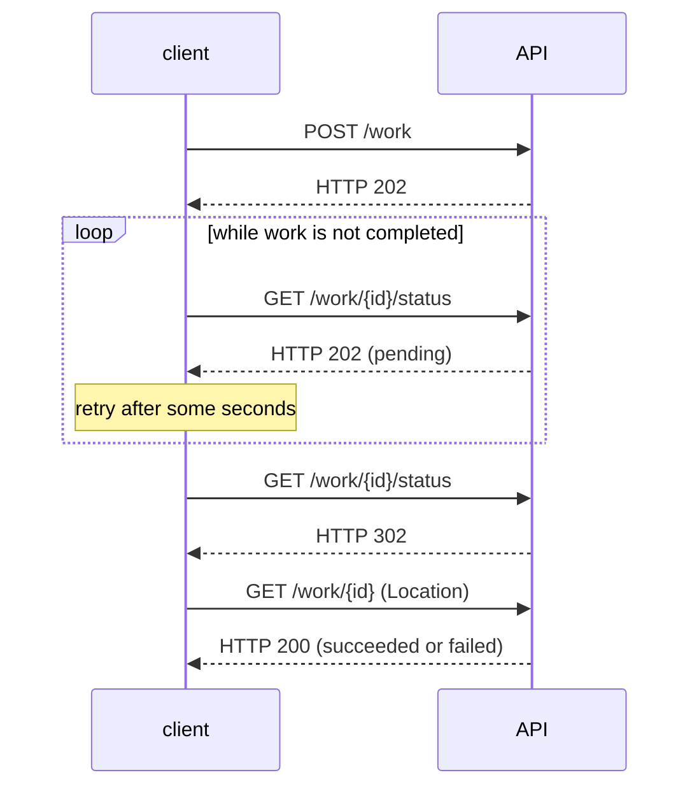

```mermaid
sequenceDiagram
    participant client
    participant api as API

    client->>api: POST /work
    api-->>client: HTTP 202

    loop while work is not completed
        client->>api: GET /work/{id}/status
        api-->>client: HTTP 202 (pending)

        Note over client: retry after some seconds
    end

    client->>api: GET /work/{id}/status
    api-->>client: HTTP 302

    client->>api: GET /work/{id} (Location)
    api-->>client: HTTP 200 (succeeded or failed)
```